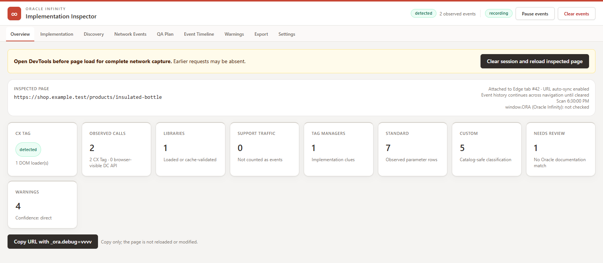
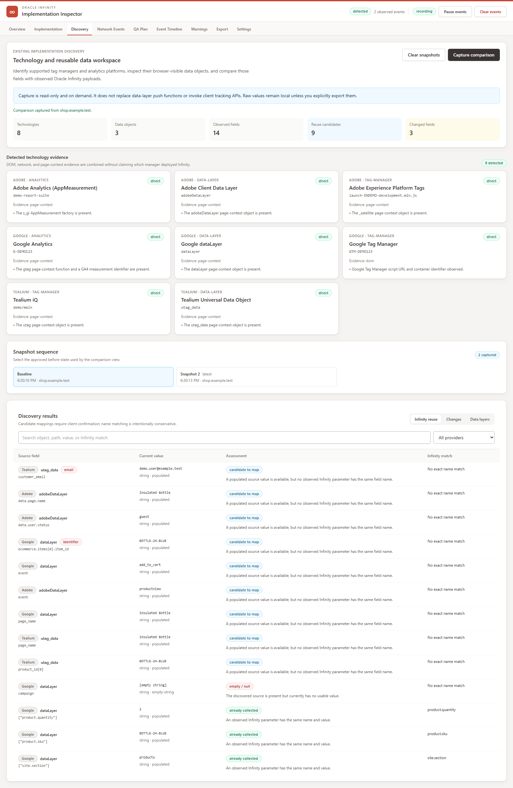
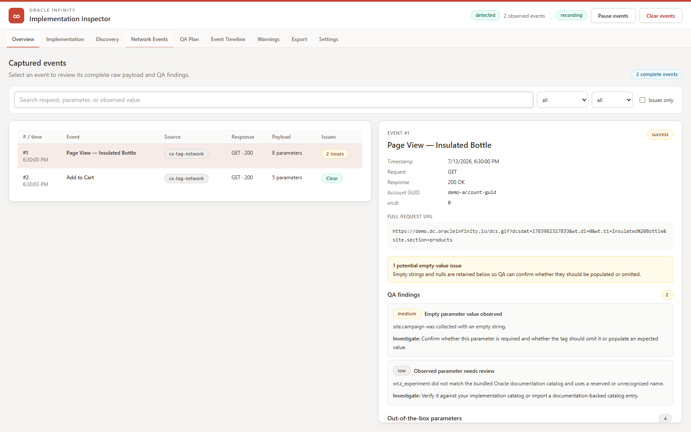
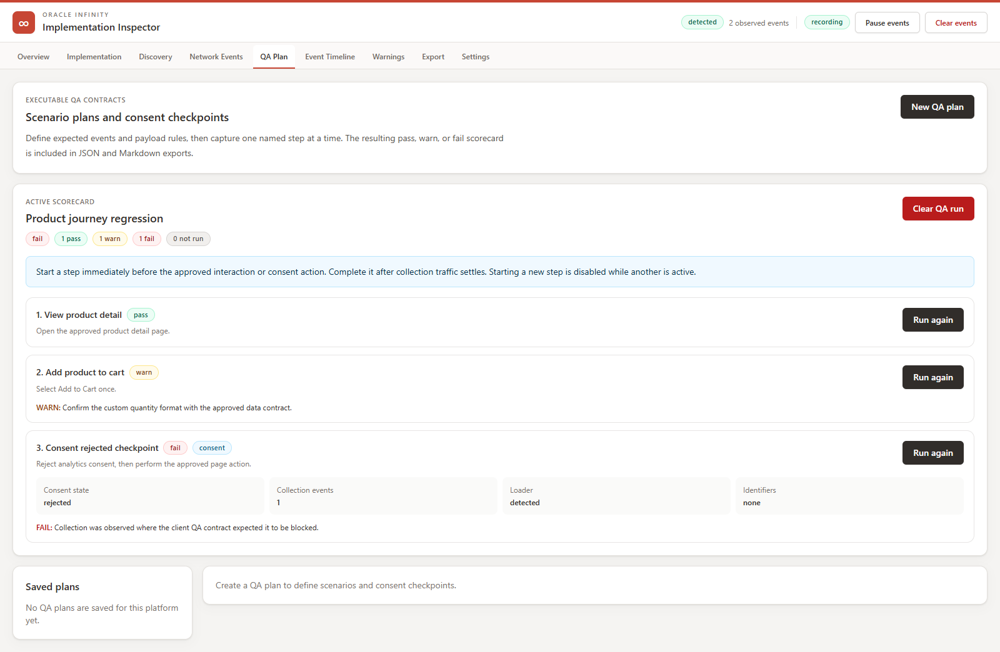
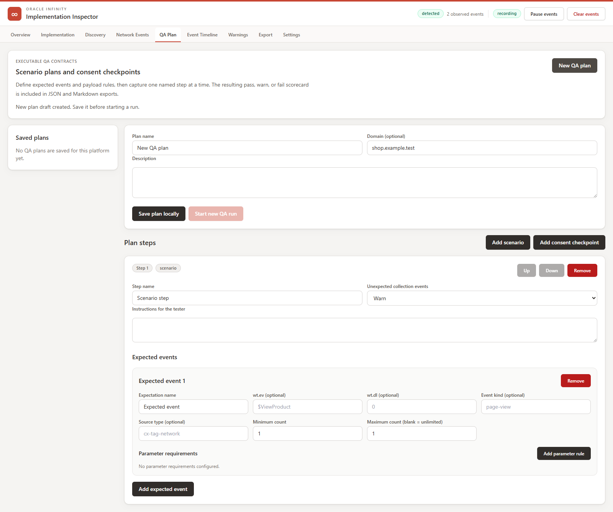
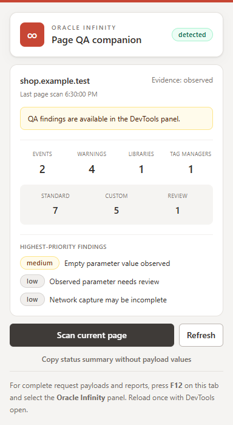

# Oracle Infinity Inspector

Oracle Infinity Inspector is a local-first Microsoft Edge and Chromium DevTools extension for inspecting and documenting Oracle Infinity implementations. It reports CX Tag loader evidence, browser-visible collection events, complete observed payloads, implementation warnings, existing analytics technology and reusable data-layer candidates, and QA-ready reports.

The extension is distributed as a ready-built GitHub release package and as source code. It is loaded as an unpacked extension and is not published in the Microsoft Edge Add-ons or Chrome Web Store.

## What it does

- Detects Oracle CX Tag loaders and common tag-manager implementation clues.
- Discovers supported Google, Adobe, and Tealium technology evidence and browser-visible data-layer fields without invoking client tracking APIs.
- Compares before/after data-layer snapshots and identifies conservative candidates that could be mapped into Infinity.
- Separates Infinity libraries and support traffic from data collection events.
- Deduplicates overlapping HAR and live-network observations using deterministic request identities.
- Captures browser-visible `dcs.gif` and DC API v3 event payloads.
- Continuously retains a bounded per-tab event journey across navigation, with pause, resume, and clear controls.
- Classifies parameters using Oracle's documented parameter reference.
- Highlights empty strings, explicit nulls, raw email addresses, and other QA concerns.
- Validates documented Oracle commerce events and value formats.
- Runs reusable QA plans with named scenario captures, event counts, required/forbidden/non-empty parameter rules, and optional value patterns.
- Records client-configurable consent checkpoints for collection, loader, and identifier expectations before choice, after rejection, after acceptance, or after withdrawal.
- Exports complete local QA reports and pass/warn/fail contract scorecards as JSON or Markdown.
- Routes product-specific detection, validation, terminology, and export metadata through a typed platform adapter designed for future Oracle analytics generations.
- Provides a lightweight toolbar companion for page scans and payload-free status sharing.

The extension never calls Oracle tracking functions, changes page requests, uploads captured data, or sends telemetry.

## Product tour

The Overview combines implementation evidence, event counts, parameter classifications, and QA findings in one DevTools workspace.



Discovery identifies supported Google, Adobe, and Tealium tooling, explores bounded page-context data snapshots, compares an approved before/after interaction, and distinguishes fields already collected by Infinity from candidates that require client-confirmed mapping.



Network Events keeps each complete event and its payload together, including out-of-the-box, custom, unknown, empty, and null values.



QA Plan turns an approved test plan into explicit capture steps. Each completed scenario or consent checkpoint receives a pass, warn, or fail result and retains its supporting event evidence for export.





The toolbar companion can scan the current page, show cached evidence, surface priority findings, and copy a summary that excludes payload values.



All public screenshots are generated from synthetic `example.test` evidence. They contain no client URLs, identifiers, or payloads.

## Browser compatibility

Oracle Infinity Inspector uses standard Chromium Manifest V3, DevTools, runtime, tabs, and storage APIs. It does not use an Edge-only API, but browser support still differs by verification level:

| Browser                                                 | Support level           | Notes                                                                                                                                                    |
| ------------------------------------------------------- | ----------------------- | -------------------------------------------------------------------------------------------------------------------------------------------------------- |
| Microsoft Edge 102+                                     | Verified and supported  | Primary development target; automated Edge smoke tests and authorized real-site QA are part of the release process.                                      |
| Google Chrome 102+                                      | Expected compatible     | Uses the same required Chromium extension APIs. Chrome is documented for unpacked installation but is not yet part of the automated browser test matrix. |
| Brave, Vivaldi, Opera, and other Chromium 102+ browsers | Expected but unverified | The extension may load, but DevTools placement, extension policies, and API behavior can vary by browser.                                                |
| Firefox and Safari                                      | Unsupported             | Their extension and DevTools architectures require a separate port.                                                                                      |

The minimum version is 102 because the extension uses `chrome.storage.session`. See [Installation](docs/INSTALLATION.md) for browser-specific loading steps and [Known Limitations](docs/LIMITATIONS.md) before using an unverified browser for client QA.

## Install in a Chromium browser

### Recommended: ready-built release package

1. Open the [latest GitHub release](https://github.com/mchua1291/oracle-infinity-inspector/releases/latest).
2. Download the `oracle-infinity-inspector-vX.Y.Z-edge.zip` asset and extract it to a permanent folder.
3. Open `edge://extensions` in Edge. Chrome users can follow the browser-specific steps in [Installation](docs/INSTALLATION.md#load-in-google-chrome).
4. Enable **Developer mode** and select **Load unpacked**.
5. Select the extracted folder containing `manifest.json`.

The `-edge.zip` filename identifies Edge as the verified release target; the package itself is a standard unpacked Chromium extension. The accompanying `.sha256` file can be used to verify the downloaded ZIP. Unpacked extensions do not update automatically; replace the extracted files and reload the extension when a new version is published.

### Build from source

Requirements: [Node.js 20 or newer](https://nodejs.org/), Git, and Microsoft Edge for verified testing or Google Chrome 102+ for expected-compatible testing.

```powershell
git clone https://github.com/mchua1291/oracle-infinity-inspector.git
cd oracle-infinity-inspector
npm install
npm run build
```

After building:

1. Open `edge://extensions`, enable **Developer mode**, and select **Load unpacked**.
2. Select the repository's generated `dist` folder.
3. Open a site you are authorized to test.
4. Open DevTools, then select the **Oracle Infinity** panel. Use the DevTools `»` overflow menu if the panel is hidden.
5. In the panel, select **Clear session and reload inspected page** before evaluating the implementation.

See [Installation](docs/INSTALLATION.md) for updating, removal, Chrome instructions, and common setup problems.

## Recommended QA workflow

1. Open DevTools on the target tab before reloading the page.
2. Clear the inspector session and reload.
3. Review **Overview** and **Implementation** for the loader, libraries, account configuration, load mode, and tag-manager clues.
4. In **Discovery**, capture a baseline, perform one approved interaction, capture a comparison, and review supported data-layer fields that may be reusable in Infinity.
5. In **QA Plan**, create or select a reusable plan with named scenario steps and any required consent checkpoints.
6. Start one step immediately before its approved interaction, wait for collection traffic to settle, then complete the step.
7. Review the step's pass/warn/fail result and supporting findings. Repeat for each step.
8. Open **Network Events** to inspect each complete payload and review empty/null values, custom parameters, and **Warnings**.
9. Configure an expected domain profile in **Settings** when validating a known implementation.
10. Export JSON for machine-readable evidence or Markdown for a readable report with discovery evidence and the contract scorecard.

Event recording starts automatically when the DevTools panel opens and continues across navigation
within the attached tab. Use **Pause events** when an interaction should not be added, or **Clear
events** to remove the live history while retaining completed QA-step evidence.

The toolbar popup is useful for a quick loader/status check, but complete network capture and reports require the DevTools panel.

The Export tab requires a local acknowledgement that the report contains raw client data before
download or clipboard actions are enabled.

Reports contain raw browser-visible values and may contain client identifiers or other client data. Store and delete them according to the client's approved QA evidence and retention process.

See [Usage](docs/USAGE.md) for a detailed walkthrough and [QA Guide](docs/QA_GUIDE.md) for safe fixture and real-site testing.

## Important limitations

- Only traffic visible to the inspected browser tab can be captured. Server-side, mobile, batch, and backend DC API traffic is outside the extension's visibility.
- DevTools is attached to one browser tab. Open DevTools separately on another tab.
- Opening DevTools after page load can miss earlier requests. Clear and reload before drawing conclusions.
- Loader and tag-manager detection is evidence-based and cannot always prove which rule, container, or consent decision produced a request.
- Discovery is limited to supported page-context objects and recognizable browser traffic. Self-hosted, proxied, renamed, inaccessible, or server-side implementations can remain undetected, and candidate mappings require client confirmation.
- Consent checkpoints evaluate only configured expectations against browser-visible collection events, loader evidence, and identifier parameters. They are not a consent-management platform or a legal-compliance determination.
- Microsoft Edge 102+ is the verified target. Chrome 102+ is expected-compatible, while other Chromium browsers are unverified; Firefox and Safari are unsupported.

Read [Known Limitations](docs/LIMITATIONS.md) before using absence of evidence as a QA conclusion.

## Development

```powershell
npm install
npm run typecheck
npm run audit:dead-code
npm test
npm run lint
npm run build
npm run smoke:edge
```

`smoke:edge` is an optional visible-browser test that requires Microsoft Edge. It builds the
extension, loads it into an isolated temporary Edge profile, blocks Oracle fixture traffic, verifies
panel-activated DOM capture, and renders the popup.

Generated output is written to `dist` and is intentionally not committed. After rebuilding, reload the unpacked extension from `edge://extensions` and reopen DevTools.

## Documentation

- [Installation and updates](docs/INSTALLATION.md)
- [Using the inspector](docs/USAGE.md)
- [Client and product demonstration guide](docs/DEMO_GUIDE.md)
- [Troubleshooting](docs/TROUBLESHOOTING.md)
- [QA and fixture guide](docs/QA_GUIDE.md)
- [Oracle Infinity detection rules](docs/ORACLE_INFINITY_DETECTION.md)
- [Existing technology and reusable data discovery](docs/DISCOVERY.md)
- [Privacy and security](docs/PRIVACY_AND_SECURITY.md)
- [Architecture](docs/ARCHITECTURE.md)
- [Platform adapter architecture](docs/PLATFORM_ADAPTERS.md)
- [Known limitations](docs/LIMITATIONS.md)
- [Contributing](CONTRIBUTING.md)
- [Security policy](SECURITY.md)

## License status

No open-source license is currently granted for this project. Public availability of the source
does not grant permission to use, modify, or redistribute it. Contact the repository owner for
permission before using the source or packaged extension outside an authorized evaluation.

This project is an independent QA utility and is not an Oracle product. Oracle and Oracle Infinity are trademarks of Oracle and/or its affiliates.
